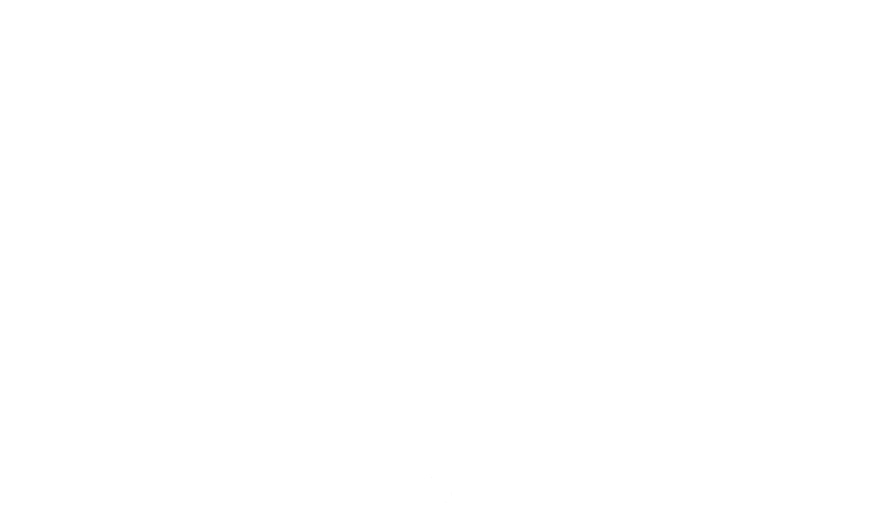
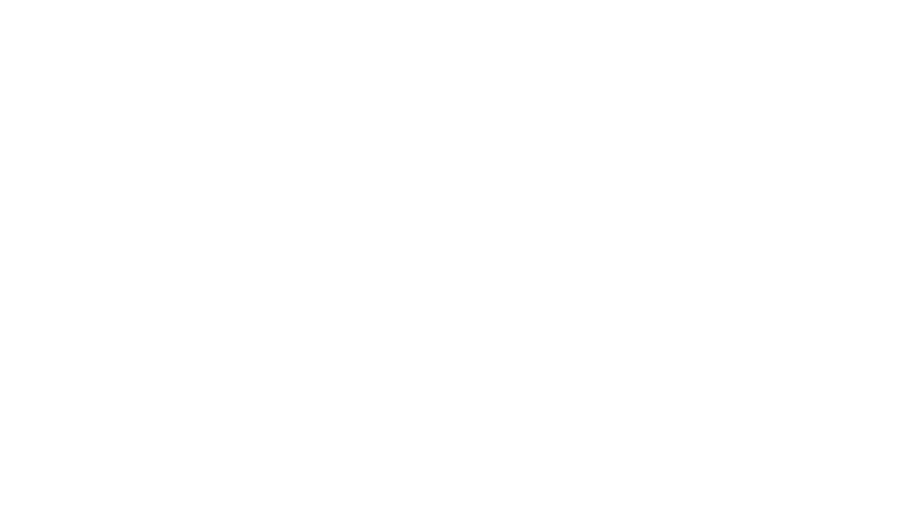

# BICI visual assets

All visual assets used for BICI rides will be stored here in a permenant fashion for future reuse. Message the maintainer or `@bill_lol` on Discord to add content to the repository, if you are not familiar with Git/Github. If you are familiar with the tools, feel free to submit a pull request to add more content.

## Useful assets

Final versions of icons and logos are available [here](/imgs/final-imgs/). Flyers are available [here](/flyers/) If you're just looking for ez-mode, here you go:

Not for commercial use. Copywrite William David MacMillan and BICI, 2023. Usage governed via CC0 1.0 Universal.
